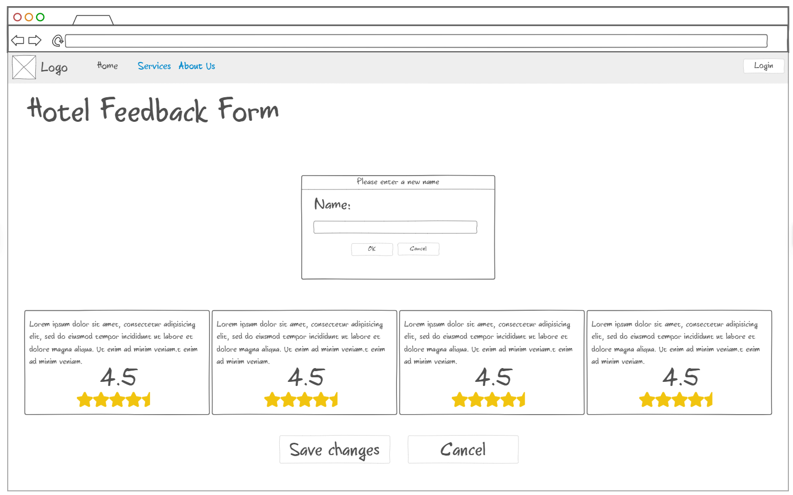

# User story title: Customer Feedback Form

## Priority: 30

## Estimation: 1 days
* Louis: 1 days

## Assumptions (if any):
* Customers will have access to a feedback form where they can provide comments, ratings, and suggestions about their stay
* The feedback form will be easily accessible and intuitive to use, encouraging customers to provide feedback

## Description:
Description-v1: The customers will be able to provide feedback on their stay through a feedback form, so the hotel can improve its services.

## Tasks, see chapter 4.
1. Design the user interface for the "Customer Feedback Form" page, including form fields for comments, ratings, and suggestions (Estimation 0.5 days)
2. Develop the backend functionality to store customer feedback in a database (Estimation 0.5 days)

# UI Design:

# Completed:
* (New, not in the textbook) 
* Insert screenshots of completed. 
* If you have multiple versions (changes between iteractions), show them all.
