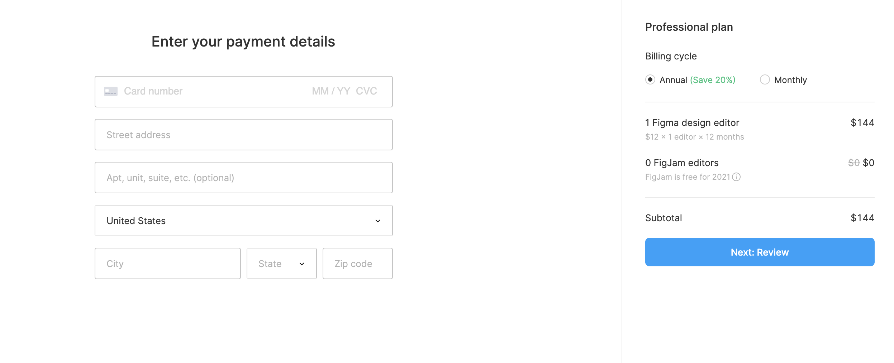

# User story title: Customer Payment

## Priority: 10

## Estimation: 2 days
* Louis: 2 days

## Assumptions (if any):
* After some research, WooCommerce Stripe is a good payment plugin that could be implement for the website
* Customers will have access to a secure payment portal where they can enter their payment details
* The payment portal will support multiple payment methods, such as credit cards, PayPal, and other common options
* The payment portal will encrypt payment information to ensure security and compliance with payment industry standards

## Description:
Description-v1: The customers will be able to securely pay for their booking using a credit card or other payment methods, so they can confirm their reservation easily

## Tasks, see chapter 4.
1. Design the user interface for the "Customer Payment Portal" page, including fields for entering payment details and selecting payment methods (Estimation 0.5 days)
2. Develop the backend functionality to process payment transactions securely, including integration with payment gateway services (Estimation 0.5 days)
3. Implement encryption for sensitive payment information to ensure security (Estimation 1 days)

# UI Design:

# Completed:
* (New, not in the textbook) 
* Insert screenshots of completed. 
* If you have multiple versions (changes between iteractions), show them all.
